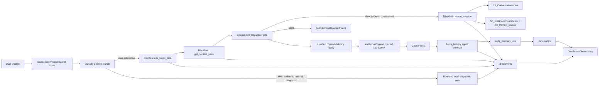

# DinoBrain Codex Hooks

Date: 2026-07-01

DinoBrain can show how it interacts with Codex by combining two pieces:

1. A Codex `UserPromptSubmit` hook that runs before the model turn. The preferred install path is a managed hook under `C:\ProgramData\OpenAI\Codex\requirements.toml`; the user-level `C:\Users\<you>\.codex\hooks.json` hook remains as a fallback.
2. A local Observatory page that polls DinoBrain event, task, trace, Context Pack, and memory audit files.

## Flow



## Files

- `.codex/hooks.json`
- `C:\Users\<you>\.codex\hooks.json`
- `C:\ProgramData\OpenAI\Codex\requirements.toml`
- `C:\ProgramData\OpenAI\Codex\DinoBrainHooks\dinobrain-managed-user-prompt-hook.ps1`
- `scripts/dinobrain-user-prompt-hook.ps1`
- `scripts/dinobrain-user-prompt-hook.mjs`
- `scripts/install-codex-managed-hook.ps1`
- `scripts/dinobrain-observatory.mjs`
- `AGENTS.md`

The installer writes a managed hook block to `C:\ProgramData\OpenAI\Codex\requirements.toml` when it has permission. Codex managed hooks are trusted by policy, so this avoids the fragile first-run user trust prompt for the required pre-response OS path. If ProgramData is not writable during install, run `DinoBrain Codex Managed Hook Admin.cmd` or `npm run codex:hooks:managed`.

The installer also writes a user-level fallback hook to `C:\Users\<you>\.codex\hooks.json` so DinoBrain can run preflight from any Codex workspace when managed hooks are unavailable. It runs an installed-hook handshake by simulating one `UserPromptSubmit` event through the same PowerShell wrapper Codex will call. The repo keeps `.codex/hooks.json` as a project-level fallback and verification fixture.

User-level Codex hooks still require hook trust. Review the user-level hook, the project hook, and the hook scripts, then trust DinoBrain when Codex asks. A running Codex session may need a restart or new thread before it loads newly added hooks. The installer handshake and approval helper prove and guide the hook command path, but they cannot bypass Codex's trust prompt for user hooks.

Registration and trust are separate states. `codex:hooks:diagnose` and
`verify:codex-live` report visible hook trust metadata when Codex stores it in
`hooks.json`. If the DinoBrain hook is registered but no `trusted_hash` or
state metadata is visible and no live `codex_prompt_submitted` event appears,
the safe diagnosis is that `/hooks` approval is still required for the current
command hash or Codex is storing trust in a location this repository cannot
inspect directly.

The hook classifies every launch as `user_interactive`,
`internal_codex_service`, `ambient_suggestion`, `title_generation`,
`diagnostic_probe`, or `unknown`. Only `user_interactive` launches can create a
durable task, Context Pack, session archive, candidate, or sync action.

If multiple hook paths are active, the hook runtime uses `.dino/hook-locks` for
the in-flight launch and a local-only `.dino/tmp/hook-receipts` record keyed by
hook run id, prompt hash, and client session identity. Replaying the same stable
session turn reuses the first verified preflight instead of creating a second
task. The PowerShell wrapper drains child output asynchronously and emits a
visible fail-closed response when preflight exceeds its bounded timeout.

The action gate does not trust caller-declared Context Pack fields. It verifies
the task-bound pack path, bytes, SHA-256, age, ordered events, and the tools
actually registered by the running MCP server. Data-vault sync requests also
run the real sync policy as a dry-run. Results are `allow`,
`constrained_action`, or `block` with explicit reason codes.

`codex_preflight_completed` is appended only after the report, stable receipt,
and final `additionalContext` payload are ready. The event stores the ordered
chain, a delivery nonce, and the payload SHA-256. This proves hook delivery
readiness; a fresh real-client proof is still required to prove model use.

## Commands

```powershell
npm run build
npm run hook:verify
npm run prompt:eligibility:verify
npm run pre-response:gate:verify
npm run verify:codex-loop
npm run verify:codex-live:recent
npm run verify:codex-live -- --snippet "unique prompt text" --since "2026-07-07T00:00:00Z"
npm run codex:hooks:managed
npm run codex:live-proof
npm run observatory
```

If the live verifier reports stale Codex or stale DinoBrain MCP processes, run:

```powershell
npm run codex:hooks:diagnose
npm run codex:hooks:approval
npm run codex:live-proof
```

The approval helper restarts processes that were already running before
`hooks.json`, `requirements.toml`, or `dist/index.js` changed, reopens Codex, copies `/hooks` to the
clipboard, and keeps the final trust decision in the user's hands.
`codex:hooks:diagnose` also warns when the current `CODEX_THREAD_ID` predates
`hooks.json` or `requirements.toml`; that case needs a fresh Codex Desktop thread even when no running Codex process is stale.
The live-proof helper then opens a separate proof window, copies a unique proof
prompt, and keeps polling the real live verifier until a `codex_desktop`
preflight event appears. The `npm run codex:live-proof` command itself returns
after the proof window starts. By default the proof window waits up to one hour,
so there is time to approve hooks and create the fresh proof thread.

Use a fresh Codex Desktop thread for the proof. A long-running thread that was
created before `hooks.json` or `requirements.toml` changed can keep running without dispatching the new
`UserPromptSubmit` hook, even when the current Codex process is not stale.

Open:

```text
http://127.0.0.1:3847/
```

If global `npm` is not available, use the portable Node runtime installed by `install.ps1`.

## What The Hook Stores

The hook records bounded task and event data, not raw full conversation logs. It redacts obvious secret patterns such as OpenAI key shapes, GitHub token shapes, AWS access key shapes, bearer/JWT tokens, API key assignments, token assignments, secret assignments, password assignments, cookie assignments, and private-key blocks before calling DinoBrain MCP tools.

For normal prompts the hook also calls `import_session` with the redacted user
prompt. This creates a local-only session archive and pending review candidates,
but does not put those candidates into default retrieval. Sensitive prompts are
restricted to metadata-only task/gate evidence: session import, memory growth,
and automatic sync are skipped. A request that combines sensitive material with
persistence or sync intent is blocked and auto-terminaled with a trace.

It writes:

- `.dino/tasks/<task_id>.json`
- `.dino/context-packs/<pack_id>.json`
- `10_Conversations/raw/<session_id>.json`
- `50_Instances/candidates/<candidate_id>.json`
- `80_Review_Queue/promotion/<candidate_id>.json`
- `.dino/events/<date>.jsonl`
- `reports/live-hooks/<hook-run>.json`

Durable user tasks include a lease id, owner id, heartbeat time, and expiry.
The injected protocol passes the lease id back to `finish_task`; long-running
work renews it with `heartbeat_task`. Internal and diagnostic launches write
only bounded local diagnostics and receipts, never the durable paths above.

The `reports/` directory is local-only and ignored by git.

## Session Import Controls

Environment variables:

- `DINOBRAIN_HOOK_IMPORT_SESSION=0` disables automatic prompt import.
- `DINOBRAIN_HOOK_RAW_RETENTION=metadata_only` stores only message metadata and hashes instead of redacted previews.
- `DINOBRAIN_HOOK_SESSION_MAX_CANDIDATES` caps extracted candidates per prompt.

## Current Limits

- Managed Codex hooks require ProgramData write access at install/update time. They still require a full Codex restart and a fresh thread before live proof.
- Codex must trust project hooks before the project fallback hook runs.
- Codex must trust the user-level hook before the user fallback preflight runs.
- A registered user-level hook is not enough evidence by itself; live proof
  requires either visible trust metadata plus a real event, or at minimum the
  real `codex_prompt_submitted` and `codex_preflight_completed` events for a
  fresh trusted prompt.
- Synthetic verification is not live proof. `verify:codex-live:recent` must pass before claiming the current Codex Desktop session is actually dispatching pre-response DinoBrain preflight.
- The current already-running session may not retroactively load this hook, although the installer now verifies the wrapper path with a synthetic prompt.
- A fresh projectless or delegated app thread can still fail to dispatch the user-level hook. `send_message_to_thread` and other app-tool delegation paths are not accepted as live proof; paste the proof prompt manually into a trusted Codex Desktop workspace thread after `/hooks` approval.
- Automatic import currently sees the submitted user prompt, not the later assistant response.
- The hook starts the task and injects context. `finish_task` is still an agent protocol step at the end of work, but the injected protocol now includes structured `context_pack_paths`, `used_memory_paths`, `session_archive_paths`, and `candidate_paths` values to preserve.
- After `finish_task`, `audit_memory_use` can create a short trust log that Observatory displays as the latest memory audit.
- The Observatory shows file-backed events in near real time by polling; it is not a remote telemetry service.
