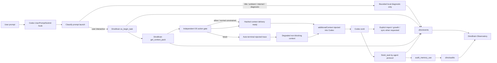

# DinoBrain Codex Hooks

Date: 2026-07-12

DinoBrain can show how it interacts with Codex by combining two pieces:

1. A Codex `UserPromptSubmit` hook that runs before the model turn. The managed hook under `C:\ProgramData\OpenAI\Codex\requirements.toml` is authoritative; the user-level hook remains only when managed installation is unavailable.
2. A local Observatory page that polls DinoBrain event, task, trace, Context Pack, and memory audit files.

## Flow



## Files

- `.codex/hooks.json`
- `C:\Users\<you>\.codex\hooks.json`
- `C:\ProgramData\OpenAI\Codex\requirements.toml`
- `C:\ProgramData\OpenAI\Codex\DinoBrainHooks\dinobrain-managed-user-prompt-hook.ps1`
- `scripts/dinobrain-user-prompt-hook.ps1`
- `scripts/dinobrain-user-prompt-hook.mjs`
- `scripts/install-codex-managed-hook.ps1`
- `scripts/dinobrain-observatory.mjs`
- `AGENTS.md`

The installer writes a managed hook block to `C:\ProgramData\OpenAI\Codex\requirements.toml` when it has permission. Codex managed hooks are trusted by policy, so this avoids the fragile first-run user trust prompt for the required pre-response OS path. If ProgramData is not writable during install, run `DinoBrain Codex Managed Hook Admin.cmd` or `npm run codex:hooks:managed`.

The installer stages a user-level fallback hook at `C:\Users\<you>\.codex\hooks.json`. If managed registration succeeds, it removes only DinoBrain from that file and preserves unrelated hooks. The fallback remains only when managed hooks are unavailable. The repo `.codex/hooks.json` intentionally contains no DinoBrain hook.

Managed Codex hooks require no `/hooks` trust click. A running Codex session still needs a full restart and fresh thread after managed requirements change. User trust applies only to the fallback path.

Registration and trust are separate states only for the user-level fallback.
`codex:hooks:diagnose` and `verify:codex-live` report visible fallback trust
metadata when Codex stores it in `hooks.json`. If the fallback is active and no
`trusted_hash` or state metadata is visible, `/hooks` approval may still be
required. A healthy managed hook does not use this trust surface; missing live
events there indicate a stale process/thread or a dispatch/runtime failure.

The hook classifies every launch as `user_interactive`,
`internal_codex_service`, `ambient_suggestion`, `title_generation`,
`diagnostic_probe`, or `unknown`. Only `user_interactive` launches can create a
durable task, Context Pack, session archive, candidate, or sync action.

If multiple hook paths are active, the hook runtime uses `.dino/hook-locks` for
the in-flight launch and a local-only `.dino/tmp/hook-receipts` record keyed by
hook run id, prompt hash, and client session identity. Replaying the same stable
session turn reuses the first verified preflight instead of creating a second
task. The Node hook uses a cooperative timeout to terminalize any task it
started, then emits degraded non-blocking context. The PowerShell wrapper keeps
a larger hard timeout and terminates the marked process tree if the cooperative
path cannot return. Neither timeout emits `decision:block` to Codex.

The action gate does not trust caller-declared Context Pack fields. It verifies
the task-bound pack path, bytes, SHA-256, age, ordered events, and the tools
actually registered by the running MCP server. Data-vault sync requests also
run the real sync policy as a dry-run. Results are `allow`,
`constrained_action`, or `block` with explicit reason codes.

`codex_preflight_completed` is appended only after the report, stable receipt,
and final `additionalContext` payload are ready. The event stores the ordered
chain, a delivery nonce, and the payload SHA-256. This proves hook delivery
readiness; a fresh real-client proof is still required to prove model use.

## Commands

```powershell
npm run build
npm run hook:verify
npm run prompt:eligibility:verify
npm run pre-response:gate:verify
npm run verify:codex-loop
npm run verify:codex-live:recent
npm run verify:codex-live -- --snippet "unique prompt text" --since "2026-07-07T00:00:00Z"
npm run codex:hooks:managed
npm run codex:live-proof
npm run observatory
```

If the live verifier reports stale Codex or stale DinoBrain MCP processes, run:

```powershell
npm run codex:hooks:diagnose
npm run codex:live-proof
```

When diagnostics explicitly report that the user-level fallback is active, run
`npm run codex:hooks:approval` before the live proof. The approval helper
restarts processes that were already running before `hooks.json` or
`dist/index.js` changed, reopens Codex, copies `/hooks` to the clipboard, and
keeps the final fallback trust decision in the user's hands.
`codex:hooks:diagnose` also warns when the current `CODEX_THREAD_ID` predates
`hooks.json` or `requirements.toml`; that case needs a fresh Codex Desktop thread even when no running Codex process is stale.
The live-proof helper then opens a separate proof window, copies a unique proof
prompt, and keeps polling the real live verifier until a `codex_desktop`
preflight event appears. The `npm run codex:live-proof` command itself returns
after the proof window starts. By default the proof window waits up to one hour,
so there is time to restart Codex, approve a fallback hook when needed, and
create the fresh proof thread.

Use a fresh Codex Desktop thread for the proof. A long-running thread that was
created before `hooks.json` or `requirements.toml` changed can keep running without dispatching the new
`UserPromptSubmit` hook, even when the current Codex process is not stale.

Open:

```text
http://127.0.0.1:3847/
```

If global `npm` is not available, use the portable Node runtime installed by `install.ps1`.

## What The Hook Stores

The hook records bounded task and event data, not raw full conversation logs. It redacts obvious secret patterns such as OpenAI key shapes, GitHub token shapes, AWS access key shapes, bearer/JWT tokens, API key assignments, token assignments, secret assignments, password assignments, cookie assignments, and private-key blocks before calling DinoBrain MCP tools.

Installed lean mode does not call `import_session`, memory growth, compounding,
or sync on every prompt. Those operations are explicit bounded task actions.
Sensitive prompts remain restricted to metadata-only task/gate evidence. A
request that combines sensitive material with persistence or sync intent is
rejected for that state-changing action and terminaled with a trace, while
ordinary conversation continues without rejected memory.

It writes:

- `.dino/tasks/<task_id>.json`
- `.dino/context-packs/<pack_id>.json`
- `.dino/events/<date>.jsonl`
- `reports/live-hooks/<hook-run>.json`

Explicit `import_session` additionally writes local conversation archives and
review candidates.

Durable user tasks include a lease id, owner id, heartbeat time, and expiry.
The injected protocol passes the lease id back to `finish_task`; long-running
work renews it with `heartbeat_task`. Internal and diagnostic launches write
only bounded local diagnostics and receipts, never the durable paths above.

The `reports/` directory is local-only and ignored by git.

## Session Import Controls

Environment variables:

- `DINOBRAIN_HOOK_IMPORT_SESSION=0` is the installed default; set `1` only for an explicit bounded import workflow.
- `DINOBRAIN_HOOK_RAW_RETENTION=metadata_only` stores only message metadata and hashes instead of redacted previews.
- `DINOBRAIN_HOOK_SESSION_MAX_CANDIDATES` caps extracted candidates per prompt.

## Current Limits

- Managed Codex hooks require ProgramData write access at install/update time. They still require a full Codex restart and a fresh thread before live proof.
- The repo carries no DinoBrain project hook, avoiding managed/project duplication.
- Codex must trust the user-level hook only when managed registration failed and the fallback remains active.
- A registered user-level hook is not enough evidence by itself; live proof
  requires either visible trust metadata plus a real event, or at minimum the
  real `codex_prompt_submitted` and `codex_preflight_completed` events for a
  fresh trusted prompt.
- Synthetic verification is not live proof. `verify:codex-live:recent` must pass before claiming the current Codex Desktop session is actually dispatching pre-response DinoBrain preflight.
- The current already-running session may not retroactively load this hook, although the installer now verifies the wrapper path with a synthetic prompt.
- A delegated app thread is not accepted as live proof; paste the proof prompt manually into a fresh Codex Desktop workspace thread after managed-hook reload.
- Installed lean mode disables automatic session import, sync, growth, and compounding. Invoke those operations explicitly for a bounded task.
- The hook starts the task and injects context. `finish_task` is still an agent protocol step at the end of work, but the injected protocol now includes structured `context_pack_paths`, `used_memory_paths`, `session_archive_paths`, and `candidate_paths` values to preserve.
- After `finish_task`, `audit_memory_use` can create a short trust log that Observatory displays as the latest memory audit.
- The Observatory shows file-backed events in near real time by polling; it is not a remote telemetry service.
