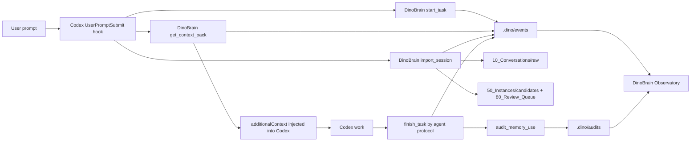

# DinoBrain Codex Hooks

Date: 2026-07-01

DinoBrain can show how it interacts with Codex by combining two pieces:

1. A Codex `UserPromptSubmit` hook that runs before the model turn.
2. A local Observatory page that polls DinoBrain event, task, trace, Context Pack, and memory audit files.

## Flow



## Files

- `.codex/hooks.json`
- `C:\Users\<you>\.codex\hooks.json`
- `scripts/dinobrain-user-prompt-hook.ps1`
- `scripts/dinobrain-user-prompt-hook.mjs`
- `scripts/dinobrain-observatory.mjs`
- `AGENTS.md`

The installer writes a user-level hook to `C:\Users\<you>\.codex\hooks.json` so DinoBrain can run preflight from any Codex workspace. It also runs an installed-hook handshake by simulating one `UserPromptSubmit` event through the same PowerShell wrapper Codex will call. Then it launches `DinoBrain Codex Hook Approval.cmd`, which can restart stale Codex desktop processes, reopen Codex, copy `/hooks`, and show the trust steps. The repo keeps `.codex/hooks.json` as a project-level fallback and verification fixture.

Codex requires hook trust. Review the user-level hook, the project hook, and the hook scripts, then trust DinoBrain when Codex asks. A running Codex session may need a restart or new thread before it loads newly added hooks. The installer handshake and approval helper prove and guide the hook command path, but they cannot bypass Codex's trust prompt.

If both the user-level hook and project hook are trusted, the hook runtime uses `.dino/hook-locks` to avoid duplicate task records for the same prompt.

## Commands

```powershell
npm run build
npm run hook:verify
npm run verify:codex-loop
npm run verify:codex-live:recent
npm run verify:codex-live -- --snippet "unique prompt text" --since "2026-07-07T00:00:00Z"
npm run codex:live-proof
npm run observatory
```

If the live verifier reports stale Codex or stale DinoBrain MCP processes, run:

```powershell
npm run codex:hooks:diagnose
npm run codex:hooks:approval
npm run codex:live-proof
```

The approval helper restarts processes that were already running before
`hooks.json` or `dist/index.js` changed, reopens Codex, copies `/hooks` to the
clipboard, and keeps the final trust decision in the user's hands.
The live-proof helper then opens a separate proof window, copies a unique proof
prompt, and keeps polling the real live verifier until a `codex_desktop`
preflight event appears. The `npm run codex:live-proof` command itself returns
after the proof window starts.

Use a fresh Codex Desktop thread for the proof. A long-running thread that was
created before `hooks.json` changed can keep running without dispatching the new
`UserPromptSubmit` hook, even when the current Codex process is not stale.

Open:

```text
http://127.0.0.1:3847/
```

If global `npm` is not available, use the portable Node runtime installed by `install.ps1`.

## What The Hook Stores

The hook records bounded task and event data, not raw full conversation logs. It redacts obvious secret patterns such as OpenAI key shapes, GitHub token shapes, AWS access key shapes, bearer/JWT tokens, API key assignments, token assignments, secret assignments, password assignments, cookie assignments, and private-key blocks before calling DinoBrain MCP tools.

By default the hook also calls `import_session` with the redacted user prompt. This creates a local-only session archive and pending review candidates, but does not put those candidates into default retrieval.

It writes:

- `.dino/tasks/<task_id>.json`
- `.dino/context-packs/<pack_id>.json`
- `10_Conversations/raw/<session_id>.json`
- `50_Instances/candidates/<candidate_id>.json`
- `80_Review_Queue/promotion/<candidate_id>.json`
- `.dino/events/<date>.jsonl`
- `reports/live-hooks/<hook-run>.json`

The `reports/` directory is local-only and ignored by git.

## Session Import Controls

Environment variables:

- `DINOBRAIN_HOOK_IMPORT_SESSION=0` disables automatic prompt import.
- `DINOBRAIN_HOOK_RAW_RETENTION=metadata_only` stores only message metadata and hashes instead of redacted previews.
- `DINOBRAIN_HOOK_SESSION_MAX_CANDIDATES` caps extracted candidates per prompt.

## Current Limits

- Codex must trust project hooks before the hook runs.
- Codex must trust the user-level hook before global preflight runs.
- Synthetic verification is not live proof. `verify:codex-live:recent` must pass before claiming the current Codex Desktop session is actually dispatching pre-response DinoBrain preflight.
- The current already-running session may not retroactively load this hook, although the installer now verifies the wrapper path with a synthetic prompt.
- Automatic import currently sees the submitted user prompt, not the later assistant response.
- The hook starts the task and injects context. `finish_task` is still an agent protocol step at the end of work, but the injected protocol now includes structured `context_pack_paths`, `used_memory_paths`, `session_archive_paths`, and `candidate_paths` values to preserve.
- After `finish_task`, `audit_memory_use` can create a short trust log that Observatory displays as the latest memory audit.
- The Observatory shows file-backed events in near real time by polling; it is not a remote telemetry service.
