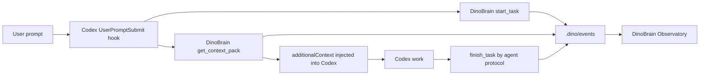

# DinoBrain Codex Hooks

Date: 2026-07-01

DinoBrain can show how it interacts with Codex by combining two pieces:

1. A Codex `UserPromptSubmit` hook that runs before the model turn.
2. A local Observatory page that polls DinoBrain event, task, trace, and Context Pack files.

## Flow



## Files

- `.codex/hooks.json`
- `scripts/dinobrain-user-prompt-hook.ps1`
- `scripts/dinobrain-user-prompt-hook.mjs`
- `scripts/dinobrain-observatory.mjs`
- `AGENTS.md`

The project hook requires Codex hook trust. Review `.codex/hooks.json` and the hook scripts, then trust the hook when Codex asks. A running Codex session may need a restart or new thread before it loads newly added hooks.

## Commands

```powershell
npm run build
npm run hook:verify
npm run observatory
```

Open:

```text
http://127.0.0.1:3847/
```

If global `npm` is not available, use the portable Node runtime installed by `install.ps1`.

## What The Hook Stores

The hook records bounded task and event data, not raw full conversation logs. It redacts obvious secret patterns such as OpenAI key shapes, API key assignments, token assignments, secret assignments, password assignments, and private-key blocks before calling DinoBrain MCP tools.

It writes:

- `.dino/tasks/<task_id>.json`
- `.dino/context-packs/<pack_id>.json`
- `.dino/events/<date>.jsonl`
- `reports/live-hooks/<hook-run>.json`

The `reports/` directory is local-only and ignored by git.

## Current Limits

- Codex must trust project hooks before the hook runs.
- The current already-running session may not retroactively load this hook.
- The hook starts the task and injects context. `finish_task` is still an agent protocol step at the end of work.
- The Observatory shows file-backed events in near real time by polling; it is not a remote telemetry service.
